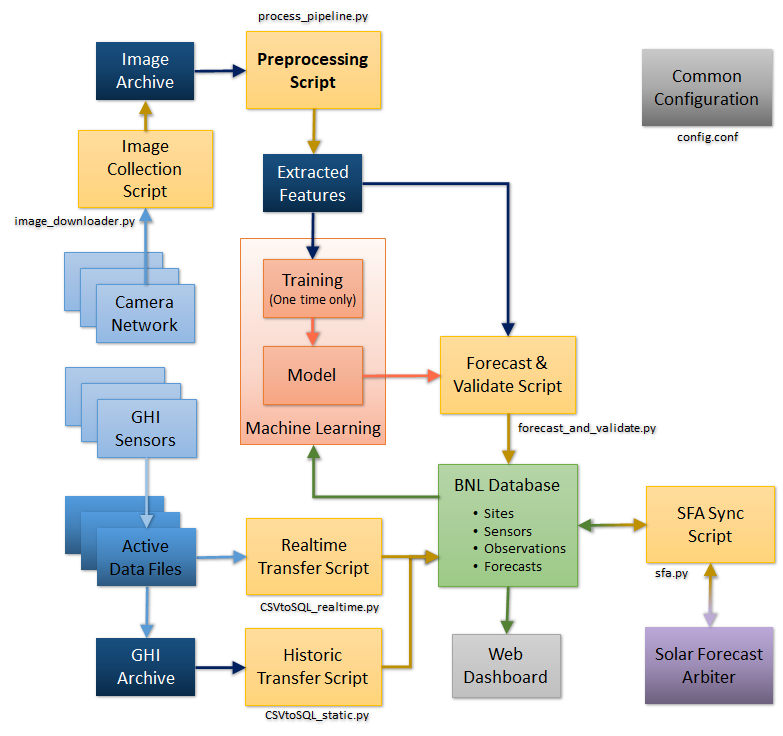

# SolarForecasting

## Project configuration

1. Install conda from the anaconda [site](https://www.anaconda.com/products/individual)
2. Open a terminal and check that conda is available
    - conda --version
3. Remove (base) from the terminal 
    - conda config --set auto_activate_base false
4. Create an environment for the project     
    - conda create -n solar python=3.9
5. Activate the environment    
    - conda activate solar
6. Upgrade pip    
    - pip install --upgrade pip
7. Install dependencies

    Base dependencies:
    - conda install numpy pandas scipy matplotlib scikit-image ephem netcdf4 pytz ray[default] cython pvlib
    - conda install pytables -c conda-forge
    - conda install pyfftw -c conda-forge
    - pip install sklearn
   
    Dependencies for the data viewer:
    - conda install pyqt5 pyqtgraph
    
    Dependencies for database and Solar Forecast Aribiter connection:
    - conda install tzdata sqlalchemy pymysql
    - pip install solarforecastarbiter

8. Build "rolling" binary:
    - cd \<SolarForecastingDir\>/rolling
    - python setup.py install

9. Edit the file config.conf file with your paths and configuration. (Dates can be a single day, i.e. 201812019, or a range.)
10. Run the code:    
    - python process_pipeline.py    
    - python forecast_and_validate.py    
    - python sfa.py

## Algorithm flowchart

