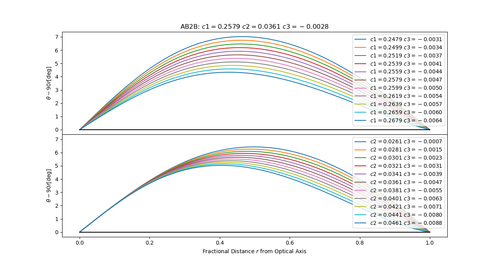
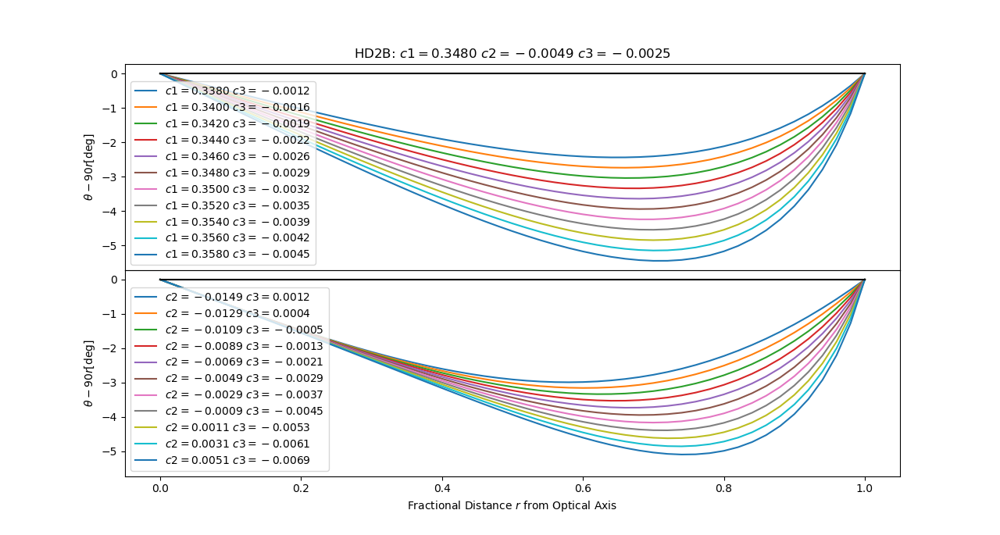

# HD Sky Camera Optics and Orientation Calibration #

## Description of Camera and Parameters ##

The project used Vivotek High Definition Fish-eye cameras (models FE8391 2944x2944, and ??), but this calibration should be applicable to any hemispheric sky camera (180&deg; FOV).

### Camera Specific Optics Parameters ###

The FOV is projected onto a circular area on the CMOS detector centered at a pixel location of `cx,cy` and radius `pr0`. The camera optics are assumed to be azimuthal uniform. The view angle dependence is described by the roots of the 3 odd powers of a 5-th order polynomial:
`c3*rx**5+c2*rx**3+c1*rx-r=0`
where `rx` is the independent variable, and `r` is the fractional distance from the optical axis, i.e. `sqrt((x-cx)**2+(y-cy)**2)/pr0`, and `c1,c2,c3` are the parameters used to describe this view angle dependence. To illustrate the meaning of these parameters I varied either `c1` (top panel) or `c2` (bottom panel) while constraining `c3` such that the view angle is 90&deg; at `r=1`. The illustrations show the deviation of the viewing angle from the ideal &theta;[&deg;]`=90r` (black line).



### Orientation Angles ###

The orientation of the camera is described by 3 angles:

- `rot`: the azimuthal deviation from north (positive is east of north)
- `beta`: the tilt angle (optical axis from zenith)
- `azm`: the azimuthal direction of the tilt (east of north)

## Measurement Approach ##

In order to determine these parameters for field deployed cameras a reference object of known position is needed. Of the celestial objects the moon is the only one that can be properly exposed without causing saturation. The Sun is too bright and the stars too dim for these cameras. To eliminate some ambiguity caused by the interaction of some of these 9 parameters, it is important to have observations spread out as much as possible across the circular active detector area. The moon reaches maximum elevation in December and minimum in June, so to provide maximal coverage lunar observations should be collected for 6 months either July through December or January through June.

## Code Usage ##

The code is divided in two independly run programs to

1. [find_moon_all.py][]: Determine the detector location of the centroid of each moon image for the 3 nights centered around every full-moon
2. [optimizeOrientation.py][]: Do a non-linear least-squares fit of the predicted sky coordinates from the ephemerides `pyephem` to the sky coordinates determined from the pixel coordinates from step 1 using the 6 camera optics and 3 orientation angles as the fitting parameters.

Both of these programs are invoked from the command-line:

```
cd "run-time-conf-dir"
python3 path_to_program.py [camera_calibration_site.conf [[cameraID] [...]]]
```

where the first command-line argument is the `.conf` file, see examples in run-dist sub-directory. If there are additional command-line arguments they are interpreted as the 4 character cameraIDs, e.g. HD1A, and overwrite the `cameraIDs` list in the `.conf` file. If there is only 1 command-line argument all the cameras in `cameraIDs` will be processed.

[find_moon_all.py]: find_moon_all.py

[optimizeOrientation.py]: optimizeOrientation.py


